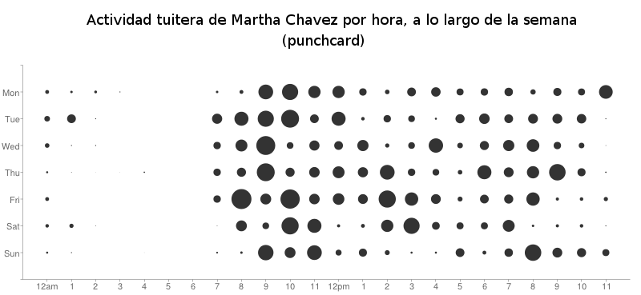

# Scripts para generar gráficos y punchcard

de usuarios de twitter.

Esto está completo en un [post de mi blog](http://aniversarioperu.wordpress.com/2013/11/23/analisis-del-comportamiento-tuitero-de-tu-congresista/)

## Requiere

* python
* matplotlib
* numpy

## Uso
La lista de 3200 tuits más recientes se genera usando el cliente [t](https://github.com/sferik/t):

    ``t timeline -c -n 3200 MarthaChavezK36 > MarthaChavezK36.csv``

Para generar el gráfico mostrando el número de tuits por día en el tiempo, y
además el punchcard:

    ``python analizar_tuits.py MarthaChavezK36.csv | python punchcard.py -f punchcard_Martha_Chavez.png``

## Resultados

